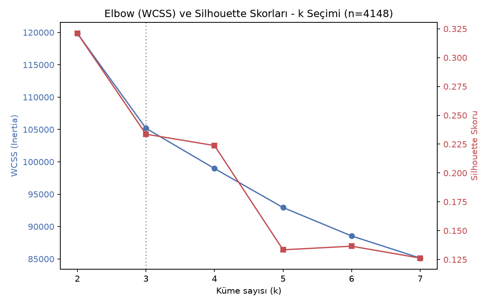
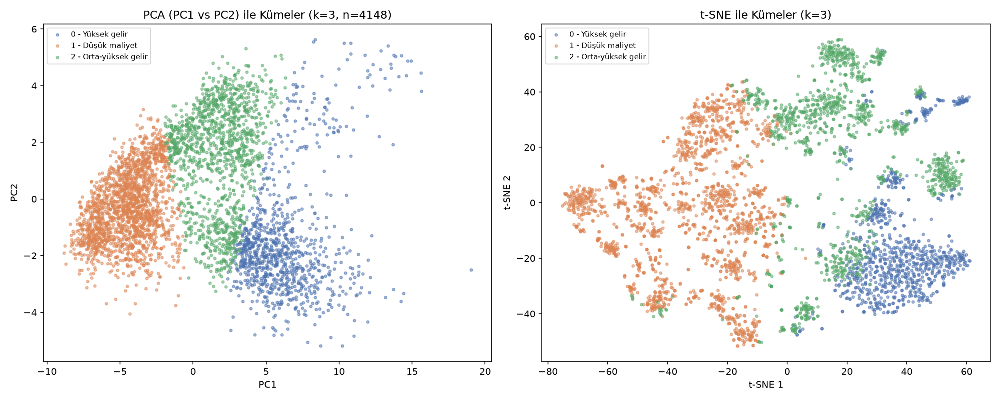
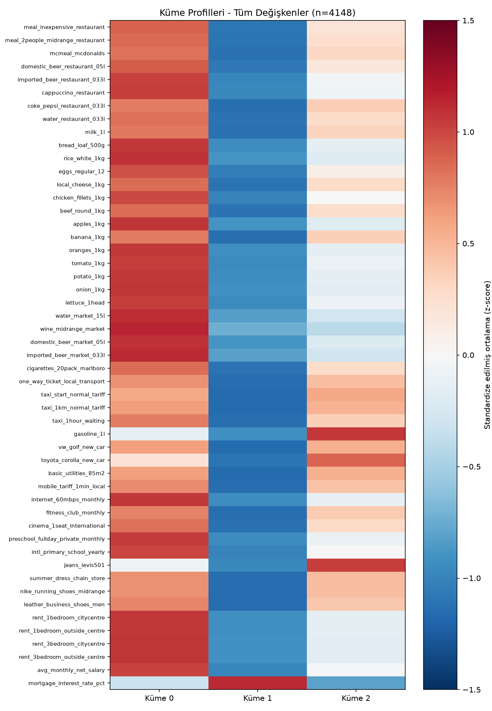

# Yaşam Maliyeti Analizi ve Kümeleme

Bu proje, yaşam maliyeti endeksi verilerini (Numbeo) kullanarak farklı lokasyonların K-Means algoritması ile kümeleme (clustering) analizini içermektedir. 

Veri seti üzerinde boyut indirgeme işlemleri uygulanmış ve lokasyonlar gelir/maliyet yapılarına göre profillendirilmiştir.

## Neler Yapıldı?
* **Veri Ön İşleme:** Eksik verilerin (missing values) medyan ile doldurulması, aykırı değerlerin (outliers) Winsorization yöntemiyle sınırlandırılması ve standartlaştırma (StandardScaler).
* **Boyut İndirgeme:** Temel Bileşenler Analizi (PCA) ile varyansın %90'ını açıklayan bileşenlerin seçilmesi ve t-SNE ile görselleştirme.
* **Kümeleme (Clustering):** Elbow metodu ve Silhouette skoru kullanılarak optimum küme sayısının (k=3) belirlenmesi ve K-Means algoritmasının uygulanması.
* **Profillendirme:** Kümelerin (Yüksek gelir, Orta-yüksek gelir, Düşük maliyet) ortalama yaşam maliyeti kalemlerine göre ısı haritası (heatmap) ile yorumlanması.

## Kullanılan Teknolojiler
* Python (Pandas, Numpy)
* Scikit-learn (KMeans, PCA, TSNE, SimpleImputer, StandardScaler)
* Matplotlib (Veri Görselleştirme)

## Grafikler
### 1. Küme Sayısı Seçimi (Elbow & Silhouette)

### 2. Kümelerin PCA ve t-SNE ile Görselleştirilmesi

### 3. Küme Profilleri Isı Haritası

